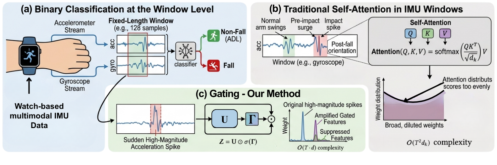

# You Don't Need Attention: Gated Convolutional Modeling for Watch-Based Fall Detection

<p align="center">
  
</p>

Existing deep learning approaches for wearable fall detection systems rely on self-attention mechanisms that impose quadratic computational overhead, distributing weights across all time steps. This global weight distribution impairs the precise localization of the brief impact signatures that characterize falls within short, fixed-length windows. To overcome this challenge, we propose Gated-CNN, a lightweight dual-stream architecture that processes accelerometer and gyroscope streams through independent one-dimensional convolutional feature extractors, followed by (i) a sigmoid gating module that selectively suppresses uninformative background activations while amplifying fall-discriminative features, (ii) a global average pooling layer that compresses each stream into a compact fixed-length descriptor, and (iii) a shared classification head that fuses both descriptors for binary fall prediction. For offline evaluation, we evaluate the model across five wrist-mounted inertial measurement unit (IMU) datasets, achieving average F1-scores of 93\%, 93\%, 90\%, 91\%, and 90\% on SmartFallMM, WEDA-Fall, FallAllD, UMAFall, and UP-Fall, outperforming Transformer baselines. For real-time evaluation, we deployed the model on a Google Pixel Watch 3 and tested across 12 participants. The model achieves an average F1-score of 97\% and an accuracy of 98\% with zero missed falls, showing that sigmoid gating offers a more structurally aligned and computationally efficient alternative to attention for commodity smartwatch-based fall detection.

## Read the Full Paper

For more details, please refer to our full paper: [Coming soon...](#)

***

## Prerequisites

- **Python 3.12** is required. Other versions are not guaranteed to be compatible.

***

## Installation

### 1. Clone the Repository

```bash
git clone git@github.com:txst-cs-smartfall/Gated-CNN-for-Watch-based-Fall-Detection.git
cd Gated-CNN-for-Watch-based-Fall-Detection
```

### 2. Create a Virtual Environment (Recommended)

```bash
conda create -n gated-cnn-env python=3.12
conda activate gated-cnn-env 
```

### 3. Install Dependencies

```bash
pip install -r requirements.txt
```

***

## Project Structure

``` 
├── helping_functions.py        # Data loading, preprocessing, augmentation utilities
├── gated_cnn_model.py          # Model architecture (GatedCNN dual-stream)
├── main_run.py                 # Training and evaluation entry point
├── tflite_conversion.py        # TFLite Conversion Script
├── requirements.txt            # Python dependencies
│
├── Datasets/                   # Input dataset directory
│   └── SmartFallMM-Dataset/
│       └── young/
│           ├── accelerometer/watch/
│           └── gyroscope/watch/
│
├── output_pngs/                # Saved training plots and evaluation figures
├── models/                     # Saved model checkpoints (.keras files)
└── Tflites/                    # TFLite files (.tflite)
``` 

***

## Usage

Run the main training script:

```bash
python main_run.py
```

To run in the background and log output:

```bash
nohup python main_run.py > main_run.log &
```

To stop a background run:

```bash
pkill -f main_run.py
```

***

## Resources

To support reproducibility and further research, the following resources are publicly available:

- **Dataset:** The SmartFallMM dataset used in this work is available at: [SmartFallMM Dataset](https://github.com/txst-cs-smartfall/SmartFallMM-Dataset)
- **Trained Model:** The best-performing fold Keras model (`.keras`) can be accessed at: [models/gated_cnn_smm_fold_2.keras](models/)
- **TFLite Model:** The corresponding converted TFLite model (`.tflite`) for deployment is available at: [Tflites/gated_cnn_smm_fold_2.tflite](Tflites/)
- **TFLite Conversion Script:** The script `tflite_conversion.py` loads a trained Gated CNN dual-stream `.keras` model for a specified fold and converts it to a lightweight TFLite format (`.tflite`) for on-device deployment.

***

## Notes

- Ensure the dataset folders are correctly set in `main_run.py` via the `input_folder_1` and `input_folder_2` variables.
- Model checkpoints are saved to the path defined in `checkpoint_dir`.
- Training runs for up to 10 folds by default with early stopping enabled (patience = 10).